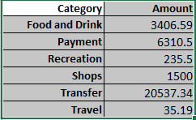
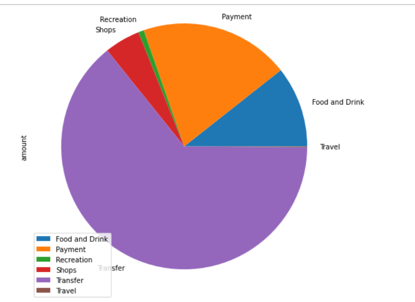
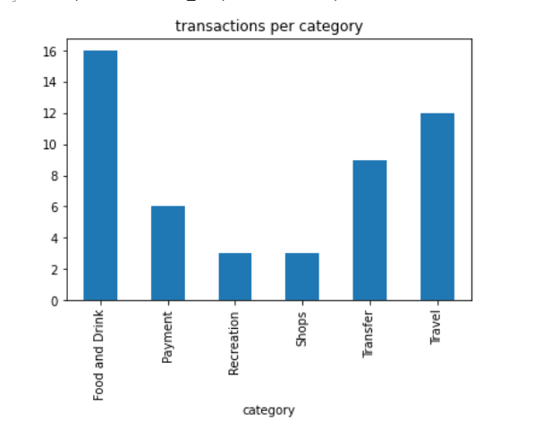
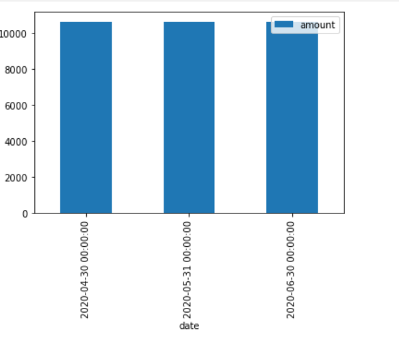
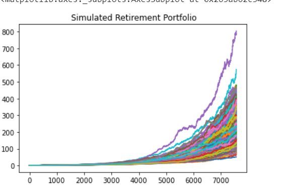
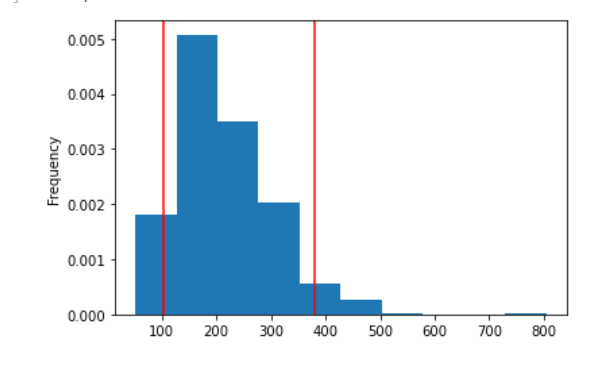
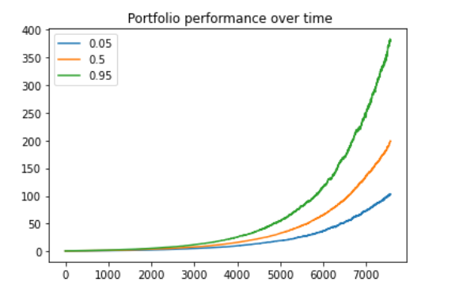

## Financial Analysis

## Budget Analysis:

We analysed the transactions for the client over the last 90 days from April 2020 to June 2020.
From the analysis we could see that the main areas of spending were as follows: 

 
 
The pie chart below provides a graphic display of the spending categories.

Although a significant portion of monthly spending goes to transfer, it is not the category with the largest number of transations. There are 9 transactions over the 90 day period, totalling $20,537.  The next biggest spending category is credit card payments.  There are 6 transactions in this category, totalling $6,310.  The below bar chart priovides a visual of the number of transactions in each category.

The bar chart below, also shows that the spending is identical each month.

## Retirement Analysis:

The client's portfolio consists of 50% stock and 40% bonds.   We analysed 500 simulations of this portfolio for the next 30 years .

The below graphs shows a graphical illustation of the portfolio performance for the necxt 30 years based on our simulations.

Based on our calcutions, we are 90% confident that the cumulative return of this portfolio will fall between $102.83 and $379.34. at the end of 30 years . As shown in below graph

The mean cumulative return is expected to be $199.08

For an initial investment of $20,000, the expected mean return will be $3,981,677.  We are 80% certain that this investment will return between $2,380,549 and $6,411,230. (that is  at the 1oth and 90th percentiles) 

When compared with the plaid analysis, a 4% withdrawal rate from this portfolio will be approximately $95, 221.  This will be more than the projected annual income from the budget analysis, which is $6,085

A 50 % increase in the initial investment, would result in a withdrawal rate of $ $142,832, which is an increase of 50%.  Therefore the percentage increase in investment would result in an equal percentage increase in the returns.

In conclusion, based on our analysis, below is the expected portfolio performnace over the next 30 years

